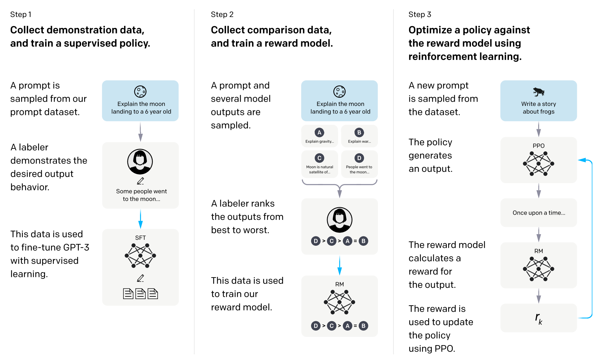

# minChatGPT

This is a custom project from [Stanford CS224N Winter 2023](https://web.stanford.edu/class/cs224n/) class. The goal of this project is to answer this question
> Will alignment from human feedback also help small language models such as GPT-2?

And the answer is YES! With RLHF, evaluation shows that ChatGPT prefers the aligned GPT-2 outputs for 96% of times over the vanilla GPT-2 outputs, and 88% times over the supervised fine-tuning baseline. Please see the technical [report](./report.pdf) for more details.

Also, you can test minChatGPT in [Colab Notebook](https://colab.research.google.com/drive/1LR1sbWTyaNAmTZ1g1M2tpmU_pFw1lyEX?usp=sharing)

**Disclaimer**: 
1. This model has not been tested or evalauted against its safety. It may generate harmful or toxic content.
2. The demo is only meant to show how to improve small models with RLHF. The performance is not comparable with any conversation systems that are backed by large language models.
3. This is not an error free codebase! In fact there may be bugs here and there. Please make an issue if you have any questions.

# Poster


# Directory
```bash
src
  |_train_ppo.py # training script for PPO 
  |_train_rm.py # trianing script for Reward Model
  |_train_sft.py # training script for SFT model
  |_tariners.py # the actual training loops and other trainer utilities, such as saving states
  |_loss.py # loss functions used in different training
  |_main.py # some scratch code to quickly test something
  |_gpt.py # GPT-2 implementation with LoRA
  |_evaluate.py # evaluate the generation with ChatGPT
  |_dataset.py # multiple datasets definition
  |_tokenizer.py # tokenizers in a unified class
  |_llama.py # wish I could have more time to test with LLaMA
init_debian.sh # in case you need to initialize a debian system from scratch
requirements.txt # dependencies without PyTorch! Install your own pytorch 2.0 nightly.
```

# Get Started
First of all, you should know that ChatGPT (or InstructGPT, which is the last open publication on this topic from OpenAI) has three stages: Supervised Fine-tuning, Reward Model Training and RL with Human Feedback (with Proximal Policy Gradient). Here's a diagram from the InstructGPT paper:



## Training
0. You need to have a GPU with at least 16GB VRAM, NVIDIA Driver 515+, CUDA 11.7+ and also Python 3.8 or higher (other versions of CUDA and Python might work but I didn't test, Python 2.0 is very demanding.).
1. Install [PyTorch 2.0](https://pytorch.org/get-started/pytorch-2.0/#getting-started)
2. Install dependencies with
```bash
pip install -r requirements.txt
```
3. The first step is to traing a SFT model, inside `src` directory, run this command. You can change batch size via `-b`. The bigger VRAM you have the larger batch size you can afford. Optionally, you can open the tensorboard.ipynb to check the training progress.
```bash
python train_sft.py -n experiment_name -b 2`
```
4. Once you finished SFT stage, you can start to train the reward model. You should have a directory started with `sft_` in your `runs` directory. Find the final model weights and run this. This should start a reward model training for 1 epoch and generate a directory started with `rm_` with weights in it.
```bash
python train_rm.py -b 2 -n experiment_name -p "./runs/path/to/your/weights"
```
5. Finally, you can start the RLHF with the reward model and SFT model you get from previous two steps. Run this command. Because the training is not stable sometimes, I stopped early around 12K steps with a batch size of 1. The final weights will be in a directory started with `ppo_`.
```bash
python train_rm.py -b 2 -n experiment_name -a "./runs/path/to/sft/weights" -c "./runs/path/to/reward_model/weights" -s naive
```

## Evaluate
0. You need to have an OpenAI account with credential key
1. Put your key into a file called "openai.key" JSON file. It should be a dictionary with a key called "OPENAI_API_KEY" and the value is your key.
2. Inside `src`, run this:
```bash
python evaluate.py -s "/path/to/sft/model" -p "/path/to/ppo/model"
```
3. This should generate the "Human" preference over each model using ChatGPT as a proxy

# Citation
just in case you need this:
```
@misc{minChatGPT,
  author = {Yanjia Li},
  title = {minChatGPT: A minimum example of aligning language models with RLHF similar to ChatGPT},
  year = {2023},
  publisher = {GitHub},
  journal = {GitHub repository},
  howpublished = {\url{https://github.com/ethanyanjiali/minChatGPT}},
}
```
# Acknowledgement
This project wouldn't been done without the help from:
1. [Stanford CS224N](https://web.stanford.edu/class/cs224n/), Professor Manning and the TAs
2. [nanoGPT](https://github.com/karpathy/nanoGPT)
3. [ColossalAI](https://github.com/hpcaitech/ColossalAI)
4. [OpenAI Baselines](https://github.com/openai/baselines)
5. [OpenAssistant](https://github.com/LAION-AI/Open-Assistant)
6. [Anthropic HH RLHF](https://github.com/anthropics/hh-rlhf)
7. And my project mentor Jesse Mu!
